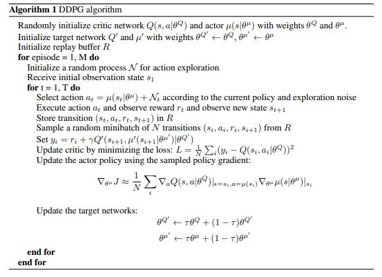
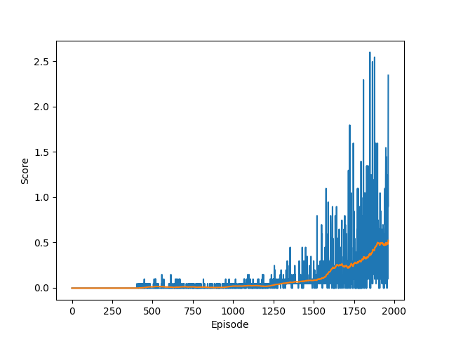

# Continous Control Project - Udacity DRL Nano Degree

## General Overview

This report is dedicated to detail the work achieved during the final project of Udacity’s DRL Nanodegree.
The objective of this project is to to play a multi agent game of tennis using Unity's ML-agents tennis environment.

## Project Structure
The code here is structured as followed:

```
📦Collaboration-Competition-DRLND
 ┣ 📜.gitignore
 ┣ 📜.pre-commit-config.yaml
 ┣ 📜README.md
 ┣ 📜Report.md
 ┣ 📜checkpoint_actor.pth
 ┣ 📜checkpoint_critic.pth
 ┣ 📜config.py
 ┣ 📜ddpg.jpg
 ┣ 📜ddpg_agent.py
 ┣ 📜env.png
 ┣ 📜environment.yml
 ┣ 📜model.py
 ┣ 📜result.png
 ┣ 📜tennis.py
 ┗ 📜train.py
 ```

 - `ddpg_agent.py`: a multi agent DDPG class along with the replay buffer.
 - `model.py`: a PyTorch deep neural actor-critic network class.
 - `train.py`: file used to launch the agent training.
 - `tennis.py`: main file to launch the project.
 - `config.py`: contains the different configs and hyperparameter used in the project.

 ## Learning Algorithm

 In this project, we implemented a model free algorithm used for learning continous actions called `DDPG`(Deep Deterministic Policy Gradient). It's basically the combination of two approaches:
- Deep Reinforcement Learning method called DQN.
- Policy Gradients.

The DDPG algorithm is as follows:



## Model architecture
The algorithm uses two deep neural networks (actor-critic) with the following structure:

1. Actor
    - Hidden: (input, 256) - ReLU
    - Hidden: (256, 128) - ReLU
    - Output: (128, action_size) - TanH

2. Critic
    - Hidden: (input, 256) - ReLU
    - Hidden: (256 + action_size, 128) - ReLU
    - Output: (128, 1) - Linear

## Hyperparameters

```python
BUFFER_SIZE = int(1e5)  # replay buffer size
BATCH_SIZE = 128        # minibatch size
GAMMA = 0.99            # discount factor
TAU = 1e-3              # for soft update of target parameters
LR_ACTOR = 1e-4         # learning rate of the actor
LR_CRITIC = 1e-4        # learning rate of the critic
WEIGHT_DECAY = 0.0001   # L2 weight decay
```

```python
DEVICE = "cuda:0"
N_EPISODES = 2000 #max episode number
MAX_T = 1000 #max timestep/episode
UPDATE_EVERY = 10 #replay buffer update rate
```

## Results

The agent was trained using the hyperparameters defined above. The env was solved after 1964 episodes with the following learning curve.



## Future work

Results can be improved if we perform a hyperparameter tuning to figure out the best recipe to boost the learning curve. We can also try other algorithms or even variants of DDPG such as Distributed Distributional Deterministic Policy Gradients D4PG.
